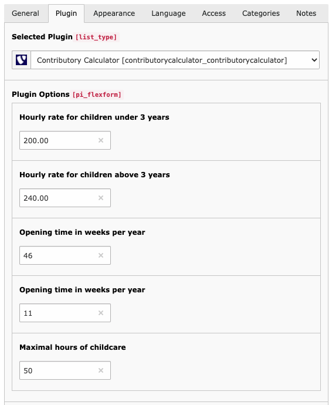

.. include:: ../Includes.txt

.. _configuration:

=============
Configuration
=============

Configuring contributory_calculator is quite easy. Let's begin.

Include static file
====================

Add the static file TypoScript from contributory calculator to your current template using the Template module > Edit > Includes.

Add and configure the plugin
=============================

Add a new content element of type (Insert plugin) list on a page where contributory calculator should be displayed.
Then open the tab "Plugin" and select "Contributory Calculator". To finish your work just configure the plugin settings
depending on your requirements.

Add chargeable income and step records
======================================

Create a folder to store those records at one place and try not to store them directly on your "page".
Then add as much records as you need of type "Chargeable Income" and "Step".

Important for Chargeable Income records.
If the field "minimal_income" equals 0 then it will be displayed as "until <maximal income>€",
if the field "maximal_income" equals 0 then it will be displayed as "above <minimal_income>€".

Custom storage page for records
================================

Use the constant editor (Template > Constant Editor > plugin.tx_contributorycalculator_contributorycalculator) to set
the storage page id where your records are stored. This is the folder you created for your chargeable income and step records!

