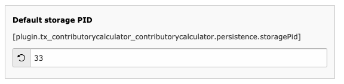

..  include:: /Includes.rst.txt

..  _configuration:

=============
Configuration
=============

Configuring contributory_calculator is quite easy. Let's begin.

Include static file
====================

Add the static file TypoScript from contributory_calculator to your current template using the
Template module > Edit > Includes.

Add and configure the plugin
============================

Add a new content element of type (Insert plugin) list on a page where contributory calculator should be displayed.
Then open the tab "Plugin" and select "Contributory Calculator".

Add care form records
=====================

Create a folder to store those records at one place and try not to store them directly on your "page".
Then add as much records as you need of type "Care".

The "Care" record contains a relation to calculation base records. You can add one calculation base
per year for your different care forms.

Custom storage page for records
================================

Use the constant editor (Template > Constant Editor > plugin.tx_contributorycalculator) to set
the storage page id where your records are stored. This is the folder you created for your care form records!

