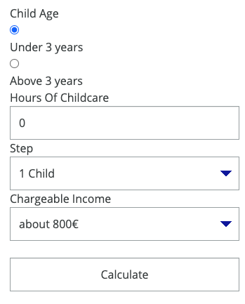

..  include:: /Includes.rst.txt

..  _introduction:

============
Introduction
============

..  _what-it-does:

What does it do?
================

This is an extension to calculate contributories in the frontend.

..  _screenshots:

Screenshots
===========

    Calculator (Frontend)

How the calculator looks like using contributory_calculator and the template from typo3muster.de
